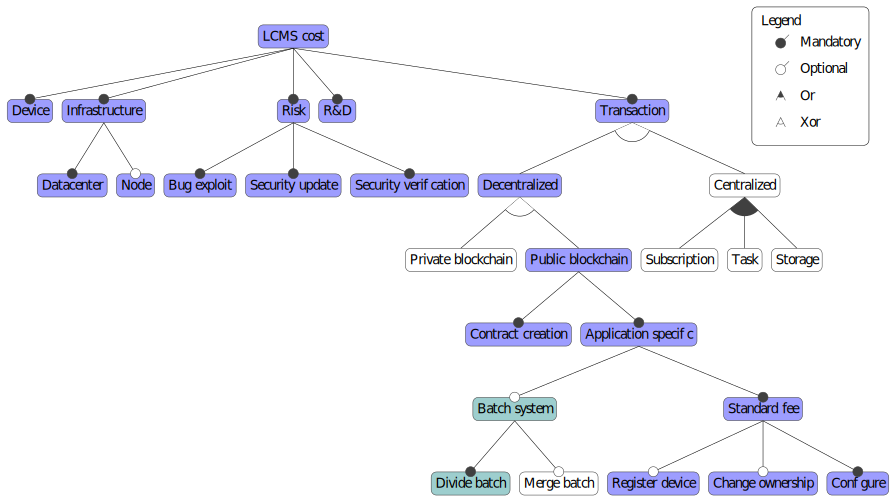

# Cost evaluation

This cost evaluation try to test if a batch based solution is better than the state of the art in the case of life cycle management system.

## Feature Cost Diagram

The feature cost diagram shows that the difference between the two approaches came from the blockchain-related part.
In the standard case, smart contracts allow to register, upgrade, and transfer SoC. In the batch case, the function differs, and the smart contract should register, upgrade, and "divide and transfer" batches.

## Hypothesis

### Actors amount

Determining the number of each transaction imply to use the SoC lifecycle to determine the number of ownership transfers.
Do to this, it is necessary to set a number of actors for each category of the life cycle.
This information is then used to determine the number of batch divisions for each scenario.
The number of actors are estimated [from public data of manufacturer](https://www.ti.com/about-ti/company/ti-at-a-glance.html) and are fixed as follows.

* One customer per IoT product is considered.
* There is one distributor for every 10000 customers.
* There is one OEM/EMS for 10 every distributors.

This distribution seeks to represent a situation that would be credible.
The closer these numbers are to reality, the more reliable the results will be.

### Scenarios

The way in which LCMS systems can be used is highly variable and depends on the product life cycle.
The life cycle of an LCMS component can be represented as follow.

The component is first manufactured, then a set of manufacturers (OEM and EMS) integrate it into products that are then dispensed by a distributor.
The device is then used by a consumer until its end of life.
An alternative exists where the products are rented rather than sold (PSS principle).
In order to compare the two approaches in realistic cases, three scenarios are used.

* Scenario 1: The case where customers are the end rights owner.
The customer is then able to transfer ownership to another user and purchase a new configuration of the component by itself.
This is a use-case that offers many possibilities, such as individualized rent of features, full customization by the product owner, and high traceability.
* Scenario 2: The case where Distributors are the end rights owner.
In this situation, customers buy a product that can't be customized.
The ability to unlock functionalities is only used by different manufacturers.
The main benefit of using LCMS in this situation is to simplify the exchange between the IC Manufacturer and the other companies. Simplifying the product offer, improving inventory management, and reinforcing traceability.
* Scenario 3: The case where IC Manufacturers retain all the rights.
In this situation, LCMS is only useful during the exchange between the IC manufacturer and his client.
The LCMS aspect is invisible to all other actors, this type of use allows to limit the quantity of product references and to propose an "à la carte" system to each customer.
Traceability is no longer possible, and other LCMS functionalities are also very limited.

## Function cost

The smart contract implementation of the two approaches is made in Solidity.
The blockchain considered for the evaluation is Ethereum.
By simulating the smart contracts, it is possible to determine their gas costs.
The Ethereum gas is the way used in the blockchain to determine fees associated with the execution of smart contracts.
Gas costs can, in theory, vary, but in the case of LCMS applications, the memory size of the input values is constant, so these costs should not vary.
Once the cost in gas of the functions is obtained, it is quick to determine their cost in US dollars:

| Functions               | State-of-the-art | Batch based |
| ----------------------- | ---------------- | ----------- |
| Contract creation       | 23.50            | 84.26       |
| Register device/batch   | 3.88             | 19.64       |
| Transfer ownership/batch| 0.84             | 40.45       |
| Upgrade configuration   | 3.18             | 2.68        |

As said before, to determine the number of transactions, the SoC lifecycle can be used as well as the number of concerned actors.
To explain how to make this, the case of 10,000 components is taken. In this case, there are 10,000 customers for 10 distributors, 1 OEM/EMS and 1 manufacturer.
For the first scenario, each component is differentiated, so it is the customers who upgrade the configuration.
The other actors only transfer ownership, and the manufacturer is responsible for the registration of the components and the creation of the contract.
In the state-of-the-art case, knowing the number of intermediary actors is not important.
Indeed, with each component already differentiated, it is necessary to make the three transfers of ownership, upgrade, and registration for each component.
In the case of a batch system, the manufacturer makes only one record for all the components, then divides the batch into as many subsets for the OEM/EMS, which themselves divide their subsets into as many Distributors, which then again divide the batch as many times as there are customers.
Finally, the customers perform the upgrade.
For scenario 2, the distributors retain the rights to the components.
So they are the ones who make the upgrades on the sets they own and don't transfer their rights.
scenario 3 requires even less differentiation between components.
Here, the manufacturer keeps all the rights.
To better reflect the logic of customization of components, the manufacturer creates as many sets as there are distributors and performs an upgrade per set.
The total costs for 10, 1000 and 10000 components for each scenario and each time for both approaches are presented below.
The calculations made to obtain these results are available in the spreadsheet.
The calculs made to obtain these results are available in the spreadsheet.

Each time, the state-of-the art approach is darker in color than the batch approach.
The bars corresponding to scenario 1 are red, those of scenario 2 are green, and those of scenario 3 are blue.
It is important to specify that the scale of the total cost of the functions is logarithmic to limit the too big difference between the values.
Several remarks can be made about these results.
First of all, whatever the scenario, the batch-less system is more efficient for the small 10-component series.
Over a larger number of products, the trend is reversed except for the first scenario, which corresponds to the worst case.