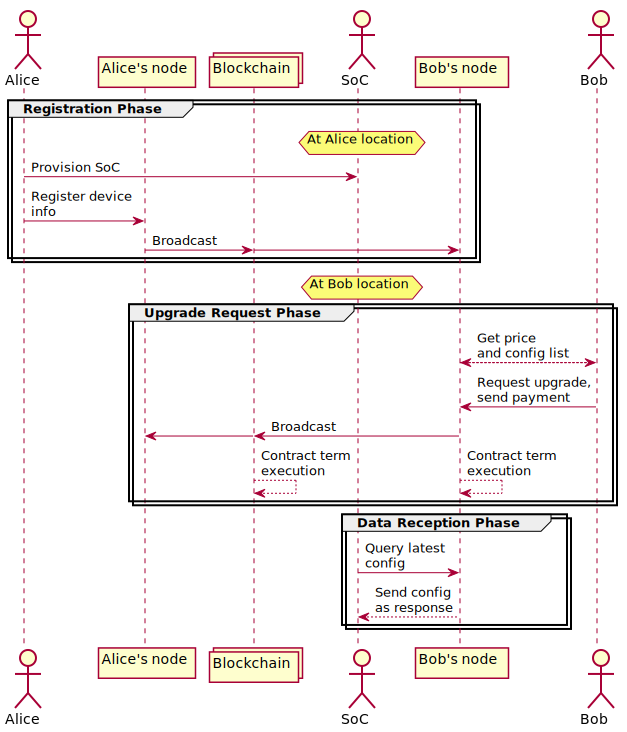
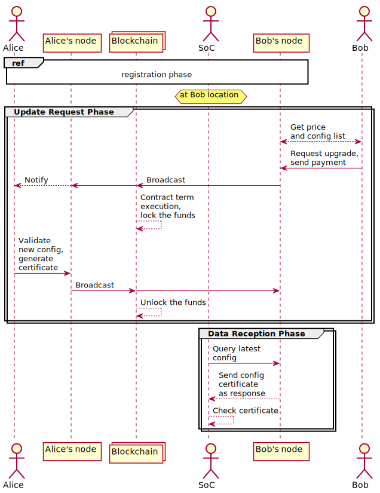
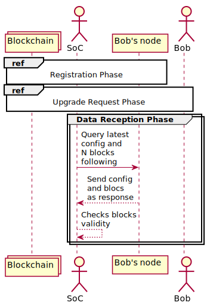

# Trustability Model

This repository contains verifiable models and associated material for verify the trustability of Blockchain based SoC reconfiguration protocols.
It contains:

* A cryptographic protocol with a trustability failure.
* Two potential fixes also modeled with VerifPal.
* Sequence diagrams representing the different models.

## Verifiable Protocol Model and fixes

All elements are modeled using [VerifPal](https://verifpal.com/).
The full VerifPal model is available in [trust.vp](trust.vp).
The first fix is trivial and directly mentionend in [trust.vp](trust.vp).
The second one is based of certificate exchange is in [fix2.vp](fix2.vp).
The third fix consisting of a partial blockchain verification by the SoC is available in [fix3.svg](fix3.vp).

VerifPal is a software tool for verifying the security of cryptographic protocols.
It is available for Windows and Linux from [this page](https://verifpal.com/software/).
Additionnal info on about how understand verifpal code can be found [here](https://verifpal.com/res/pdf/manual.pdf).

In order to verify the VerifPal model, the command has the following format:

```
./verifpal verify path/to/a_vp_script.vp
```
With "path/to" the path to the `a_vp_script.vp` file.


## Sequence diagram of models

This section presents the UML diagrams of the different elements modeled in VerifPal.

The protocol studied:



The signature based fix:



The block verification based fix:

