# LCMS Models Additionnal Materials

This repository is the additionnal material for paper submitted to a journal.
It contains verifiable models and associated material for our System-on-Chip (SoC) Life Cycle Management System (LCMS) case study.
Two distinct aspects of this LCMS are modeled:
* Its cryptographic protocol, using [Verifpal](https://verifpal.com/) and [ProVerif](https://bblanche.gitlabpages.inria.fr/proverif/).
* Its architecture model, using [AnimUML](https://github.com/fjouault/AnimUML).

A more complete interaction diagram for the system under study:


# Cryptographic Protocol Model

The cryptographic protocol was first modeled as semi-formal UML sequence diagrams before being formalized using Cryptographic verifier.

## Semi-formal Protocol Model

### Main Sequence Diagram

This sequence diagram contains references to sub-diagrams that are given below.

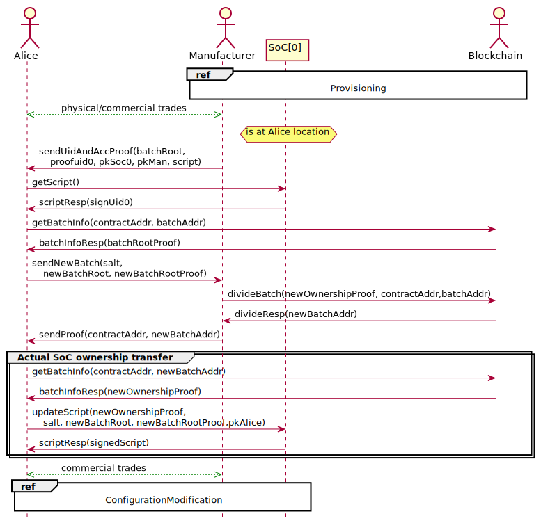

### Provisioning

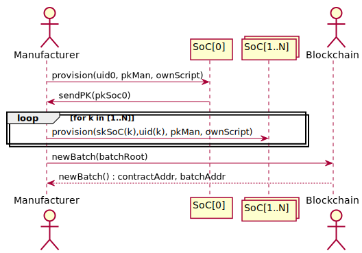

### ConfigurationModification

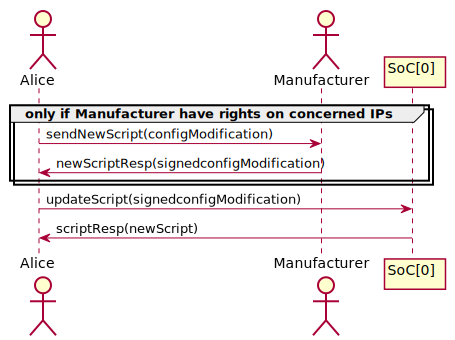


## Verifpal Protocol Model

### About Verifpal Version

The original version of Verifpal used for this work was 0.26. Since then, version 0.27 fixed a bug, and Verifpal now finds a potential attack on our model.
After analysis, this attack seems to be a false positive.
In the protocol, there are several successive checks. It seems that earlier checks should stop the iteration with a detection of the attack. However, VerifPal ignores earlier checks, which leads it to consider the scenario as a valid attack. 
The problem is that we are now unsure whether this counterexample masks a real attack, or not.

### Run the Model
The full VerifPal model is available in [LCMS_Protocol_Model.vp](LCMS_Protocol_Model.vp).

VerifPal is a software tool for verifying the security of cryptographic protocols.
It is available for Windows and Linux from [this page](https://verifpal.com/software/).

In order to verify the VerifPal model, run the following command:

```
./verifpal verify path/to/LCMS_Protocol_Model.vp
```
With "path/to" the path to the `LCMS_Protocol_Model.vp` file.

Protocol verification takes several hours.

VerifPal can also generate the following visual representation thanks to its [visual studio extension](https://marketplace.visualstudio.com/items?itemName=symbolicsoft.verifpal):

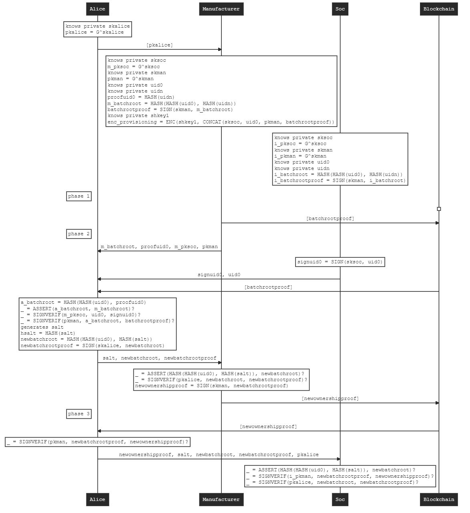

## ProVerif Protocol Model

### Intermediate Interaction Diagram

The intermediate interaction diagram, designed with AnimUML (v20221216) is [available here](https://animumlv20221216.kher.nl/AnimUML.html#{%22name%22:%22Imported_LCMS_proverif%22,%22objects%22:[{%22name%22:%22blockchain%22,%22class%22:%22Ledger%22,%22stateByName%22:{%22init%22:{%22type%22:%22Pseudostate%22,%22kind%22:%22initial%22},%22idle%22:{%22internalTransitions%22:{%22T1%22:{%22trigger%22:%22newBatch%22,%22effect%22:%22alice.batchInfoResp(true);%22},%22T2%22:{%22trigger%22:%22divideBatch%22,%22effect%22:%22alice.batchInfoResp(true);%22}}}},%22transitionByName%22:{%22init2idle_1%22:{}},%22operationByName%22:{%22newBatch%22:{%22parameters%22:[{%22name%22:%22batchRoot%22,%22type%22:%22Boolean%22}],%22private%22:false},%22getBatchInfo%22:{%22private%22:false},%22divideBatch%22:{%22parameters%22:[{%22name%22:%22newOwnershipProof%22,%22type%22:%22Boolean%22}],%22private%22:false}}},{%22name%22:%22manufacturer%22,%22class%22:%22Manufacturer%22,%22stateByName%22:{%22requestCheck%22:{%22kind%22:%22choice%22},%22init%22:{%22type%22:%22Pseudostate%22,%22kind%22:%22initial%22}},%22transitionByName%22:{%22init2provisioning_1%22:{},%22provisioning2deviceRegistration_1%22:{%22effect%22:%22soc.provisionChip()%22},%22deviceRegistration2waitRequest_1%22:{%22effect%22:%22blockchain.newBatch()%22},%22waitRequest2waitCertificateRequest_1%22:{%22trigger%22:%22requestOwnershipInfo%22,%22effect%22:%22alice.sendUidAndAccProof(true,true,true,true)%22},%22waitCertificateRequest2requestCheck_1%22:{%22trigger%22:%22sendNewBatch(salt,%20newBatchRoot,%20newBatchRootProof)%22},%22requestCheck2waitBcWrite_1%22:{%22guard%22:%22(salt%20&&%20newBatchRoot%20&&%20newBatchRootProof)%20==%20true%22,%22effect%22:%22blockchain.divideBatch()%22},%22waitBcWrite2done_1%22:{%22effect%22:%22alice.sendProof(true);%22},%22requestCheck2abort_1%22:{%22guard%22:%22else%22}},%22operationByName%22:{%22requestOwnershipInfo%22:{%22private%22:false},%22sendNewBatch%22:{%22parameters%22:[{%22name%22:%22salt%22,%22type%22:%22Boolean%22},{%22name%22:%22newBatchRoot%22,%22type%22:%22Boolean%22},{%22name%22:%22newBatchRootProof%22,%22type%22:%22Boolean%22}],%22private%22:false}}},{%22name%22:%22alice%22,%22class%22:%22Client%22,%22stateByName%22:{%22dataVerification%22:{%22kind%22:%22choice%22},%22checkOwner%22:{%22kind%22:%22choice%22},%22ownershipCertificateReception%22:{%22kind%22:%22choice%22},%22init%22:{%22type%22:%22Pseudostate%22,%22kind%22:%22initial%22}},%22transitionByName%22:{%22init2requestInfo_1%22:{},%22requestInfo2waitManInfo_1%22:{%22effect%22:%22manufacturer.requestOwnershipInfo();%22},%22waitManInfo2waitBatchInfoResp_1%22:{%22trigger%22:%22sendUidAndAccProof(arg0,%20arg1,%20arg2,%20arg3)%22,%22effect%22:%22batchRoot%20=%20arg0;%5CnproofUid0%20=%20arg1;%5CnpkSoc%20=%20arg2;%5CnpkMan%20=%20arg3;%22},%22waitBatchInfoResp2checkOwner_1%22:{%22trigger%22:%22batchInfoResp(OwnershipProof)%22},%22checkOwner2abort_1%22:{%22guard%22:%22else%22},%22checkOwner2waitSoCInfo_1%22:{%22guard%22:%22(pkMan%20&&%20OwnershipProof)%20==%20true%22,%22effect%22:%22soc.getScript();%22},%22waitSoCInfo2dataVerification_1%22:{%22trigger%22:%22scriptResp(signedUid)%22},%22dataVerification2abort_1%22:{%22guard%22:%22else%22},%22dataVerification2waitNotification_1%22:{%22guard%22:%22(signedUid%20&&%20batchRoot%20&&%20proofUid0%20&&%20pkSoc%20&&%20pkMan)%20==%20true%22,%22effect%22:%22manufacturer.sendNewBatch(true,true,true);%22},%22waitNotification2waitBcCertif_1%22:{%22trigger%22:%22sendProof(arg0)%22,%22effect%22:%22certificate%20=%20arg0;%22},%22waitBcCertif2ownershipCertificateReception_1%22:{%22trigger%22:%22batchInfoResp(newOwnershipProof)%22},%22ownershipCertificateReception2abort_1%22:{%22guard%22:%22else%22},%22ownershipCertificateReception2updateScriptToSoc_1%22:{%22guard%22:%22(newOwnershipProof%20&&%20certificate)%20==%20true%22,%22effect%22:%22soc.updateScript(true,%20true,%20true);%22},%22updateScriptToSoc2SoCConfigured_1%22:{%22effect%22:%22soc.configureSoc(true);%22}},%22operationByName%22:{%22batchInfoResp%22:{%22parameters%22:[{%22name%22:%22ownershipProof%22,%22type%22:%22Boolean%22}],%22private%22:false},%22scriptResp%22:{%22parameters%22:[{%22name%22:%22signUid%22,%22type%22:%22Boolean%22}],%22private%22:false},%22sendUidAndAccProof%22:{%22parameters%22:[{%22name%22:%22batchRoot%22,%22type%22:%22Boolean%22},{%22name%22:%22proofUid0%22,%22type%22:%22Boolean%22},{%22name%22:%22pkSoc%22,%22type%22:%22Boolean%22},{%22name%22:%22pkMan%22,%22type%22:%22Boolean%22}],%22private%22:false},%22sendProof%22:{%22parameters%22:[{%22name%22:%22certificate%22,%22type%22:%22Boolean%22}],%22private%22:false}}},{%22name%22:%22soc%22,%22class%22:%22IntegratedCircuit%22,%22stateByName%22:{%22ownershipCertificateReception%22:{%22kind%22:%22choice%22},%22configCheck%22:{%22kind%22:%22choice%22},%22init%22:{%22type%22:%22Pseudostate%22,%22kind%22:%22initial%22}},%22transitionByName%22:{%22init2waitingSecret_1%22:{},%22waitingSecret2waitingRequest_1%22:{%22trigger%22:%22provisionChip%22},%22waitingRequest2waitCertificate_1%22:{%22trigger%22:%22getScript%22,%22effect%22:%22alice.scriptResp(true)%22},%22waitCertificate2ownershipCertificateReception_1%22:{%22trigger%22:%22updateScript(newOwnershipProof,%20pkAlice,%20Hsalt)%22},%22ownershipCertificateReception2abort_1%22:{%22guard%22:%22else%22},%22ownershipCertificateReception2waitconfig_1%22:{%22guard%22:%22(newOwnershipProof%20&&%20pkAlice%20&&%20Hsalt)%20==%20true%22},%22waitconfig2configCheck_1%22:{%22trigger%22:%22configureSoc(signedConf)%22},%22configCheck2abort_1%22:{%22guard%22:%22else%22},%22configCheck2configured_1%22:{%22guard%22:%22signedConf%20==%20true%22}},%22operationByName%22:{%22provisionChip%22:{%22parameters%22:[{%22name%22:%22uid0%22,%22type%22:%22Boolean%22},{%22name%22:%22Hroot%22,%22type%22:%22Boolean%22}],%22private%22:false},%22getScript%22:{%22private%22:false},%22updateScript%22:{%22parameters%22:[{%22name%22:%22newOwnershipProof%22,%22type%22:%22Boolean%22},{%22name%22:%22pkAlice%22,%22type%22:%22Boolean%22},{%22name%22:%22Hsalt%22,%22type%22:%22Boolean%22}],%22private%22:false},%22configureSoc%22:{%22parameters%22:[{%22name%22:%22signedConf%22,%22type%22:%22Boolean%22}],%22private%22:false}}}],%22connectorByName%22:{%22C1%22:{%22ends%22:[%22manufacturer%22,%22alice%22],%22possibleMessages%22:{%22forward%22:[%22sendUidAndAccProof%22,%22sendProof%22],%22reverse%22:[%22requestOwnershipInfo%22,%22sendNewBatch%22]}},%22C2%22:{%22ends%22:[%22alice%22,%22soc%22],%22possibleMessages%22:{%22forward%22:[%22getScript%22,%22updateScript%22,%22configureSoc%22],%22reverse%22:[%22scriptResp%22]}},%22C3%22:{%22ends%22:[%22manufacturer%22,%22soc%22],%22possibleMessages%22:{%22forward%22:[%22provisionChip%22]}},%22C4%22:{%22ends%22:[%22alice%22,%22blockchain%22],%22possibleMessages%22:{%22reverse%22:[%22batchInfoResp%22]}},%22C5%22:{%22ends%22:[%22manufacturer%22,%22blockchain%22],%22possibleMessages%22:{%22forward%22:[%22newBatch%22,%22divideBatch%22]}}},%22interactions%22:{%22ConfigureBreakpoint%22:{%22title%22:null,%22lifelines%22:[%22alice%22,%22soc%22],%22events%22:[{%22arguments%22:[%22%2A%22],%22from%22:%22alice%22,%22to%22:%22soc%22,%22call%22:%22configureSoc%22,%22type%22:%22call%22},{%22type%22:%22accept%22,%22accept%22:0}]}},%22watchExpressions%22:{},%22LTLProperties%22:{},%22settings%22:{%22display%22:{%22hideLinks%22:false,%22hideClasses%22:false,%22hideOperations%22:false,%22hideMethods%22:false,%22showPorts%22:false,%22showEndNames%22:false,%22hideStateMachines%22:false,%22hideOuterSMBoxes%22:false,%22showExplicitSM%22:false,%22hideStates%22:false,%22showPseudostateInvariants%22:false,%22hideSets%22:false,%22showTransitions%22:false},%22semantics%22:{%22fireInitialTransitions%22:true,%22autoFireAfterChoice%22:true,%22autoReceiveDisabled%22:false,%22considerGuardsTrue%22:false,%22checkEvents%22:true,%22keepOneMessagePerTrigger%22:true,%22enableEventPools%22:true,%22matchFirst%22:true,%22symbolicValues%22:false,%22reactiveSystem%22:true},%22interface%22:{%22hideEmptyHistory%22:false,%22disableInteractionSelection%22:false,%22disableModelSelection%22:false,%22disableObjectSelection%22:false,%22disableDoc%22:false,%22disableSettings%22:false,%22disableHistorySettings%22:false,%22disableReset%22:false,%22disableSwitchDiagram%22:false,%22onlyInteraction%22:false,%22hideInteraction%22:false,%22disableExports%22:false,%22hideHistory%22:false,%22disableEdit%22:false,%22historyType%22:%22TCSVG%20sequence%22},%22tools%22:{}}}) or can be found in the AnimUML folder (LCMS_proverif.html).

### Run the Model

There is two different ProVerif model:
* LCMS_Protocol.pv who is a first iteration of the protocol. It contain a potential flaw due to a lack of authentication during the configuration process.
* LCMS_Protocol_v2 who model more precisely the protocol and correct issues present in the first ProVerif model.

The latest version of ProVerif (2.04) is recommended for running these models.
ProVerif can be downloaded [here](https://bblanche.gitlabpages.inria.fr/proverif/). An online demo of ProVerif where models can be copy pasted is also available [here](http://proverif20.paris.inria.fr/index.php).
 To run the verification of a specific model with the windows version, you can run the following command: 
```
.\proverif.exe model.pv
```

With "model.pv" the name of the ProVerif file.

# AnimUML Architecture Model

You can [open the full model in AnimUML (v20221216)](https://animumlv20221216.kher.nl/AnimUML.html#{%22name%22:%22Imported_ICLCM%22,%22objects%22:[{%22name%22:%22Blockchain%22,%22isActor%22:true,%22stateByName%22:{%22smartContract%22:{%22internalTransitions%22:{%22T1%22:{%22trigger%22:%22getBatchInfo()%22,%22effect%22:%22User.batchInfoResp();%22},%22T2%22:{%22trigger%22:%22divideBatch()%22,%22effect%22:%22User.divideResp();%22}}},%22init%22:{%22type%22:%22Pseudostate%22,%22kind%22:%22initial%22}},%22transitionByName%22:{%22init2smartContract_1%22:{%22source%22:%22init%22,%22target%22:%22smartContract%22}},%22operationByName%22:{%22getBatchInfo%22:{},%22divideBatch%22:{}}},{%22name%22:%22User%22,%22isActor%22:true,%22stateByName%22:{%22Actions%22:{%22internalTransitions%22:{%22T1%22:{%22guard%22:%22EP_IS_EMPTY(User)%20&&%20EP_IS_EMPTY(SecureStorage)%20&&%20EP_IS_EMPTY(SoCIPs)%22,%22effect%22:%22iface.setLcmOn();%22},%22T2%22:{%22guard%22:%22EP_IS_EMPTY(User)%20&&%20EP_IS_EMPTY(SecureStorage)%20&&%20EP_IS_EMPTY(SoCIPs)%22,%22effect%22:%22iface.setLcmOff();%22},%22T3%22:{%22guard%22:%22EP_IS_EMPTY(User)%20&&%20EP_IS_EMPTY(SecureStorage)%20&&%20EP_IS_EMPTY(SoCIPs)%22,%22effect%22:%22iface.powerOn();%22},%22T4%22:{%22guard%22:%22EP_IS_EMPTY(User)%20&&%20EP_IS_EMPTY(SecureStorage)%20&&%20EP_IS_EMPTY(SoCIPs)%22,%22effect%22:%22iface.powerOff();%22},%22T5%22:{%22guard%22:%22EP_IS_EMPTY(User)%20&&%20EP_IS_EMPTY(SecureStorage)%20&&%20EP_IS_EMPTY(SoCIPs)%22,%22effect%22:%22iface.updateScript(true);%22},%22T6%22:{%22guard%22:%22EP_IS_EMPTY(User)%20&&%20EP_IS_EMPTY(SecureStorage)%20&&%20EP_IS_EMPTY(SoCIPs)%22,%22effect%22:%22iface.updateScript(false);%22},%22T7%22:{%22guard%22:%22EP_IS_EMPTY(User)%20&&%20EP_IS_EMPTY(SecureStorage)%20&&%20EP_IS_EMPTY(SoCIPs)%22,%22effect%22:%22iface.getScript();%22},%22T8%22:{%22trigger%22:%22scriptResp()%22},%22T9%22:{%22guard%22:%22EP_IS_EMPTY(Blockchain)%20&&%20EP_IS_EMPTY(User)%20&&%20EP_IS_EMPTY(SecureStorage)%20&&%20EP_IS_EMPTY(SoCIPs)%22,%22effect%22:%22Blockchain.getBatchInfo();%22},%22T10%22:{%22guard%22:%22EP_IS_EMPTY(Blockchain)%20&&%20EP_IS_EMPTY(User)%20&&%20EP_IS_EMPTY(SecureStorage)%20&&%20EP_IS_EMPTY(SoCIPs)%22,%22effect%22:%22Blockchain.divideBatch();%22},%22T11%22:{%22trigger%22:%22batchInfoResp()%22},%22T12%22:{%22trigger%22:%22divideResp()%22}}},%22init%22:{%22type%22:%22Pseudostate%22,%22kind%22:%22initial%22}},%22transitionByName%22:{%22init2Actions_1%22:{%22source%22:%22init%22,%22target%22:%22Actions%22}},%22operationByName%22:{%22scriptResp%22:{},%22divideResp%22:{},%22batchInfoResp%22:{}}},{%22name%22:%22iface%22,%22class%22:%22ChipInterface%22,%22stateByName%22:{%22icInterface%22:{%22stateByName%22:{%22choiceUpdate%22:{%22kind%22:%22choice%22},%22pOnLcmOn%22:{%22internalTransitions%22:{%22T1%22:{%22trigger%22:%22setLcmOn()%22},%22T2%22:{%22trigger%22:%22setLcmOff()%22},%22T3%22:{%22trigger%22:%22powerOn()%22}}},%22pOnLcmOff%22:{%22internalTransitions%22:{%22T1%22:{%22trigger%22:%22updateScript(_)%22},%22T2%22:{%22trigger%22:%22getScript()%22},%22T3%22:{%22trigger%22:%22setLcmOn()%22},%22T4%22:{%22trigger%22:%22setLcmOff()%22},%22T5%22:{%22trigger%22:%22powerOn()%22}}},%22pOffLcmOff%22:{%22internalTransitions%22:{%22T1%22:{%22trigger%22:%22updateScript(_)%22},%22T2%22:{%22trigger%22:%22getScript()%22},%22T3%22:{%22trigger%22:%22powerOff()%22},%22T4%22:{%22trigger%22:%22setLcmOff()%22}}},%22pOffLcmOn%22:{%22internalTransitions%22:{%22T1%22:{%22trigger%22:%22updateScript(_)%22},%22T2%22:{%22trigger%22:%22getScript()%22},%22T3%22:{%22trigger%22:%22powerOff()%22},%22T4%22:{%22trigger%22:%22setLcmOn()%22}}},%22init%22:{%22type%22:%22Pseudostate%22,%22kind%22:%22initial%22}},%22transitionByName%22:{%22init2pOffLcmOff_1%22:{%22source%22:%22init%22,%22target%22:%22pOffLcmOff%22},%22pOffLcmOff2pOnLcmOff_1%22:{%22source%22:%22pOffLcmOff%22,%22target%22:%22pOnLcmOff%22,%22trigger%22:%22powerOn()%22,%22effect%22:%22manager.powerOn(false);%22},%22pOnLcmOff2pOffLcmOff_1%22:{%22source%22:%22pOnLcmOff%22,%22target%22:%22pOffLcmOff%22,%22trigger%22:%22powerOff()%22,%22effect%22:%22manager.powerOff();%22},%22pOffLcmOff2pOffLcmOn_1%22:{%22source%22:%22pOffLcmOff%22,%22target%22:%22pOffLcmOn%22,%22trigger%22:%22setLcmOn()%22},%22pOffLcmOn2pOffLcmOff_1%22:{%22source%22:%22pOffLcmOn%22,%22target%22:%22pOffLcmOff%22,%22trigger%22:%22setLcmOff()%22},%22pOffLcmOn2pOnLcmOn_1%22:{%22source%22:%22pOffLcmOn%22,%22target%22:%22pOnLcmOn%22,%22trigger%22:%22powerOn()%22,%22effect%22:%22manager.powerOn(true);%22},%22pOnLcmOn2pOffLcmOn_1%22:{%22source%22:%22pOnLcmOn%22,%22target%22:%22pOffLcmOn%22,%22trigger%22:%22powerOff()%22,%22effect%22:%22manager.powerOff();%22},%22pOnLcmOn2waitingScriptResp_1%22:{%22source%22:%22pOnLcmOn%22,%22target%22:%22waitingScriptResp%22,%22trigger%22:%22getScript()%22,%22effect%22:%22manager.getScript();%22},%22waitingScriptResp2pOnLcmOn_1%22:{%22source%22:%22waitingScriptResp%22,%22target%22:%22pOnLcmOn%22,%22trigger%22:%22scriptResp()%22,%22effect%22:%22User.scriptResp();%22},%22pOnLcmOn2choiceUpdate_1%22:{%22source%22:%22pOnLcmOn%22,%22target%22:%22choiceUpdate%22,%22trigger%22:%22updateScript(success)%22},%22choiceUpdate2waitingScriptUpdate_1%22:{%22source%22:%22choiceUpdate%22,%22target%22:%22waitingScriptUpdate%22,%22guard%22:%22success%20==%20true%22,%22effect%22:%22manager.updateScript(true);%22},%22choiceUpdate2waitingScriptUpdate_2%22:{%22source%22:%22choiceUpdate%22,%22target%22:%22waitingScriptUpdate%22,%22guard%22:%22else%22,%22effect%22:%22manager.updateScript(false);%22},%22waitingScriptUpdate2pOnLcmOn_1%22:{%22source%22:%22waitingScriptUpdate%22,%22target%22:%22pOnLcmOn%22,%22trigger%22:%22scriptResp()%22,%22effect%22:%22User.scriptResp();%22}}},%22init%22:{%22type%22:%22Pseudostate%22,%22kind%22:%22initial%22}},%22transitionByName%22:{%22init2icInterface_1%22:{%22source%22:%22init%22,%22target%22:%22icInterface%22}},%22operationByName%22:{%22powerOn%22:{},%22powerOff%22:{},%22setLcmOn%22:{},%22setLcmOff%22:{},%22getScript%22:{},%22scriptResp%22:{},%22updateScript%22:{%22parameters%22:[{%22name%22:%22isValid%22,%22type%22:%22Boolean%22}]}}},{%22name%22:%22manager%22,%22class%22:%22ChipLifeCycleManager%22,%22stateByName%22:{%22bootChoice%22:{%22kind%22:%22choice%22},%22normalMode%22:{%22stateByName%22:{%22init%22:{%22type%22:%22Pseudostate%22,%22kind%22:%22initial%22}},%22transitionByName%22:{%22init2nmWaiting_1%22:{%22source%22:%22init%22,%22target%22:%22nmWaiting%22,%22effect%22:%22ipCtrlr.powerOn();%22},%22nmWaiting2nmWorking_1%22:{%22source%22:%22nmWaiting%22,%22target%22:%22nmWorking%22,%22trigger%22:%22ipConfigured()%22},%22nmWorking2waitingScript_1%22:{%22source%22:%22nmWorking%22,%22target%22:%22waitingScript%22,%22trigger%22:%22wakeUp()%22,%22effect%22:%22SecureStorage.getScript();%22},%22waitingScript2updatingConfig_1%22:{%22source%22:%22waitingScript%22,%22target%22:%22updatingConfig%22,%22trigger%22:%22scriptResp()%22,%22effect%22:%22SecureStorage.setConfig();%22},%22updatingConfig2waitingConfigration_1%22:{%22source%22:%22updatingConfig%22,%22target%22:%22waitingConfigration%22,%22trigger%22:%22writeAck()%22,%22effect%22:%22ipCtrlr.updateConfig();%22},%22waitingConfigration2nmWorking_1%22:{%22source%22:%22waitingConfigration%22,%22target%22:%22nmWorking%22,%22trigger%22:%22ipConfigured()%22,%22effect%22:%22sClk.stopAlarm();%5CnIT%20=%20false;%22}}},%22clcmMode%22:{%22stateByName%22:{%22choice1%22:{%22kind%22:%22choice%22},%22executingScript%22:{%22internalTransitions%22:{%22T1%22:{%22guard%22:%22IT%20!=%20true%22,%22effect%22:%22sClk.setAlarm();%5CnIT%20=%20true;%22}}},%22init%22:{%22type%22:%22Pseudostate%22,%22kind%22:%22initial%22}},%22transitionByName%22:{%22init2clcmWaiting_1%22:{%22source%22:%22init%22,%22target%22:%22clcmWaiting%22,%22effect%22:%22valid%20=%20false;%22},%22clcmWaiting2clcmWaitingScript2_1%22:{%22source%22:%22clcmWaiting%22,%22target%22:%22clcmWaitingScript2%22,%22trigger%22:%22getScript()%22,%22effect%22:%22SecureStorage.getScript();%22},%22clcmWaitingScript22clcmWaiting_1%22:{%22source%22:%22clcmWaitingScript2%22,%22target%22:%22clcmWaiting%22,%22trigger%22:%22scriptResp()%22,%22effect%22:%22iface.scriptResp();%22},%22clcmWaiting2clcmWaitingScript_1%22:{%22source%22:%22clcmWaiting%22,%22target%22:%22clcmWaitingScript%22,%22trigger%22:%22updateScript(_valid)%22,%22effect%22:%22SecureStorage.getScript();%5Cnvalid=_valid;%22},%22clcmWaitingScript2choice1_1%22:{%22source%22:%22clcmWaitingScript%22,%22target%22:%22choice1%22,%22trigger%22:%22scriptResp()%22},%22choice12clcmWaiting_1%22:{%22source%22:%22choice1%22,%22target%22:%22clcmWaiting%22,%22guard%22:%22else%22,%22effect%22:%22scriptResp();%22},%22choice12executingScript_1%22:{%22source%22:%22choice1%22,%22target%22:%22executingScript%22,%22guard%22:%22valid%20==%20true%22,%22effect%22:%22SecureStorage.setScript(true);%5Cnvalid=false;%22},%22executingScript2waitingConfigWrite_1%22:{%22source%22:%22executingScript%22,%22target%22:%22waitingConfigWrite%22,%22trigger%22:%22writeAck()%22,%22effect%22:%22iface.scriptResp();%5CnSecureStorage.setConfig();%22},%22waitingConfigWrite2clcmWaiting_1%22:{%22source%22:%22waitingConfigWrite%22,%22target%22:%22clcmWaiting%22,%22trigger%22:%22writeAck()%22}}},%22init%22:{%22type%22:%22Pseudostate%22,%22kind%22:%22initial%22}},%22transitionByName%22:{%22init2lcmsWaitingPowerOn_1%22:{%22source%22:%22init%22,%22target%22:%22lcmsWaitingPowerOn%22},%22lcmsWaitingPowerOn2bootChoice_1%22:{%22source%22:%22lcmsWaitingPowerOn%22,%22target%22:%22bootChoice%22,%22trigger%22:%22powerOn(lcmPin)%22},%22bootChoice2clcmMode_1%22:{%22source%22:%22bootChoice%22,%22target%22:%22clcmMode%22,%22guard%22:%22lcmPin%20==%20true%22},%22bootChoice2normalMode_1%22:{%22source%22:%22bootChoice%22,%22target%22:%22normalMode%22,%22guard%22:%22else%22},%22normalMode2lcmsWaitingPowerOn_1%22:{%22source%22:%22normalMode%22,%22target%22:%22lcmsWaitingPowerOn%22,%22trigger%22:%22powerOff()%22,%22effect%22:%22ipCtrlr.powerOff();%22},%22clcmMode2lcmsWaitingPowerOn_1%22:{%22source%22:%22clcmMode%22,%22target%22:%22lcmsWaitingPowerOn%22,%22trigger%22:%22powerOff()%22}},%22operationByName%22:{%22powerOn%22:{%22parameters%22:[{%22name%22:%22lcmPin%22,%22type%22:%22Boolean%22}]},%22powerOff%22:{},%22updateScript%22:{%22parameters%22:[{%22name%22:%22isValid%22,%22type%22:%22Boolean%22}]},%22wakeUp%22:{},%22ipConfigured%22:{},%22getScript%22:{},%22scriptResp%22:{},%22writeAck%22:{}}},{%22name%22:%22ipCtrlr%22,%22class%22:%22IPActivationController%22,%22stateByName%22:{%22powerOn%22:{%22stateByName%22:{%22init%22:{%22type%22:%22Pseudostate%22,%22kind%22:%22initial%22}},%22transitionByName%22:{%22init2settingConfig_1%22:{%22source%22:%22init%22,%22target%22:%22settingConfig%22,%22effect%22:%22SecureStorage.getConfig();%22},%22settingConfig2waitingUpdate_1%22:{%22source%22:%22settingConfig%22,%22target%22:%22waitingUpdate%22,%22trigger%22:%22configResp()%22,%22effect%22:%22SoCIPs.setIPs();%5Cnmanager.ipConfigured();%22},%22waitingUpdate2settingConfig_1%22:{%22source%22:%22waitingUpdate%22,%22target%22:%22settingConfig%22,%22trigger%22:%22updateConfig()%22,%22effect%22:%22SecureStorage.getConfig();%22}}},%22init%22:{%22type%22:%22Pseudostate%22,%22kind%22:%22initial%22}},%22transitionByName%22:{%22init2powerOff_1%22:{%22source%22:%22init%22,%22target%22:%22powerOff%22},%22powerOff2powerOn_1%22:{%22source%22:%22powerOff%22,%22target%22:%22powerOn%22,%22trigger%22:%22powerOn()%22},%22powerOn2powerOff_1%22:{%22source%22:%22powerOn%22,%22target%22:%22powerOff%22,%22trigger%22:%22powerOff()%22}},%22operationByName%22:{%22powerOn%22:{},%22powerOff%22:{},%22updateConfig%22:{},%22configResp%22:{},%22IPsAreSet%22:{}}},{%22name%22:%22SecureStorage%22,%22isActor%22:true,%22stateByName%22:{%22memAccess%22:{%22internalTransitions%22:{%22T1%22:{%22trigger%22:%22getScript()%22,%22effect%22:%22manager.scriptResp();%22},%22T2%22:{%22trigger%22:%22getConfig()%22,%22effect%22:%22ipCtrlr.configResp();%22},%22T3%22:{%22trigger%22:%22setScript(none)%22,%22effect%22:%22manager.writeAck();%22},%22T4%22:{%22trigger%22:%22setConfig()%22,%22effect%22:%22manager.writeAck();%22}}},%22init%22:{%22type%22:%22Pseudostate%22,%22kind%22:%22initial%22}},%22transitionByName%22:{%22init2memAccess_1%22:{%22source%22:%22init%22,%22target%22:%22memAccess%22}},%22operationByName%22:{%22getScript%22:{},%22scriptResp%22:{},%22setScript%22:{%22parameters%22:[{%22name%22:%22isValid%22,%22type%22:%22Boolean%22}]},%22getConfig%22:{},%22setConfig%22:{}}},{%22name%22:%22sClk%22,%22class%22:%22SecureTimingSystem%22,%22stateByName%22:{%22init%22:{%22type%22:%22Pseudostate%22,%22kind%22:%22initial%22}},%22transitionByName%22:{%22init2stsWaiting_1%22:{%22source%22:%22init%22,%22target%22:%22stsWaiting%22},%22stsWaiting2stsCounting_1%22:{%22source%22:%22stsWaiting%22,%22target%22:%22stsCounting%22,%22trigger%22:%22setAlarm()%22},%22stsCounting2stsWakeUp_1%22:{%22source%22:%22stsCounting%22,%22target%22:%22stsWakeUp%22,%22trigger%22:%22after(10day)%22,%22effect%22:%22manager.wakeUp();%22},%22stsWakeUp2stsWaiting_1%22:{%22source%22:%22stsWakeUp%22,%22target%22:%22stsWaiting%22,%22trigger%22:%22stopAlarm()%22}},%22operationByName%22:{%22setAlarm%22:{},%22stopAlarm%22:{}}},{%22name%22:%22SoCIPs%22,%22isActor%22:true,%22stateByName%22:{%22waitingConfig%22:{%22internalTransitions%22:{%22T1%22:{%22trigger%22:%22setIPs()%22}}},%22init%22:{%22type%22:%22Pseudostate%22,%22kind%22:%22initial%22}},%22transitionByName%22:{%22init2waitingConfig_1%22:{%22source%22:%22init%22,%22target%22:%22waitingConfig%22}},%22operationByName%22:{%22setIPs%22:{}}}],%22connectorByName%22:{%22users2ledger%22:{%22ends%22:[%22User%22,%22Blockchain%22],%22endNames%22:[%22user%22,%22ledger%22],%22possibleMessages%22:{%22forward%22:[%22getBatchInfo%22,%22divideBatch%22],%22reverse%22:[%22batchInfoResp%22,%22divideResp%22]}},%22users2ci%22:{%22ends%22:[%22User%22,%22iface%22],%22endNames%22:[%22user%22,%22ci%22],%22possibleMessages%22:{%22forward%22:[%22updateScript%22,%22getScript%22,%22powerOn%22,%22powerOff%22,%22setLcmOn%22,%22setLcmOff%22],%22reverse%22:[%22scriptResp%22]}},%22ci2clcm%22:{%22ends%22:[%22iface%22,%22manager%22],%22endNames%22:[%22ci%22,%22clcm%22],%22possibleMessages%22:{%22forward%22:[%22updateScript%22,%22getScript%22,%22powerOn%22,%22powerOff%22],%22reverse%22:[%22scriptResp%22]}},%22clcm2sstr%22:{%22ends%22:[%22manager%22,%22SecureStorage%22],%22endNames%22:[%22sstr%22,%22clcm%22],%22possibleMessages%22:{%22forward%22:[%22getScript%22,%22setScript%22,%22setConfig%22],%22reverse%22:[%22scriptResp%22,%22writeAck%22]}},%22sts2clcm%22:{%22ends%22:[%22sClk%22,%22manager%22],%22endNames%22:[%22sts%22,%22clcm%22],%22possibleMessages%22:{%22forward%22:[%22wakeUp%22],%22reverse%22:[%22setAlarm%22,%22stopAlarm%22]}},%22ipac2sstr%22:{%22ends%22:[%22ipCtrlr%22,%22SecureStorage%22],%22endNames%22:[%22ipac%22,%22sstr%22],%22possibleMessages%22:{%22forward%22:[%22getConfig%22],%22reverse%22:[%22configResp%22]}},%22clcm2ipac%22:{%22ends%22:[%22manager%22,%22ipCtrlr%22],%22endNames%22:[%22clcm%22,%22ipac%22],%22possibleMessages%22:{%22forward%22:[%22updateConfig%22,%22powerOn%22,%22powerOff%22],%22reverse%22:[%22ipConfigured%22]}},%22ipac2socip%22:{%22ends%22:[%22ipCtrlr%22,%22SoCIPs%22],%22endNames%22:[%22ipac%22,%22socip%22],%22possibleMessages%22:{%22forward%22:[%22setIPs%22]}}},%22watchExpressions%22:{%22ifaceHasPowerOff%22:%22EP_CONTAINS(iface,%20powerOff)%22,%22clcmOff%22:%22IS_IN_STATE(manager,manager.lcmsWaitingPowerOn)%22,%22ipacOff%22:%22IS_IN_STATE(ipCtrlr,ipCtrlr.powerOff)%22,%22chipIsShutdown%22:%22IS_IN_STATE(manager,manager.lcmsWaitingPowerOn)%20&&%20IS_IN_STATE(ipCtrlr,ipCtrlr.powerOff)%22,%22ifaceHasScriptMessage%22:%22EP_CONTAINS(iface,%20updateScript)%20||%20EP_CONTAINS(iface,%20getScript)%22,%22userHasScriptResp%22:%22EP_CONTAINS(User,%20scriptResp)%22,%22ifaceIsInStatePOnLcmOn%22:%22IS_IN_STATE(iface,%20iface.icInterface.pOnLcmOn)%22,%22sstrHasSetScript%22:%22EP_CONTAINS(SecureStorage,%20setScript)%22,%22sstrHasSetConfig%22:%22EP_CONTAINS(SecureStorage,%20setConfig)%22,%22memoryWrite%22:%22EP_CONTAINS(SecureStorage,%20setScript)%20||%20EP_CONTAINS(SecureStorage,%20setConfig)%22,%22managerHasValidUpdate%22:%22IS_IN_STATE(manager,manager.clcmMode.executingScript)%22,%22IPsHasSetIP%22:%22EP_CONTAINS(SoCIPs,%20setIPs)%22},%22LTLProperties%22:{%22sanityCheck1%22:%22[](ifaceHasPowerOff%20-%3E%20%3C%3EchipIsShutdown)%22,%22liveness1_P4%22:%22[]([]ifaceIsInStatePOnLcmOn%20-%3E%20[](ifaceHasScriptMessage%20-%3E%20%3C%3E(userHasScriptResp%20||%20ifaceHasPowerOff)))%22,%22notDeadlock%22:%22[]%20!|deadlock|%22,%22liveness_P5%22:%22[](managerHasValidUpdate%20-%3E%20%3C%3E(memoryWrite%20||%20ifaceHasPowerOff))%22,%22safety1_P5%22:%22!memoryWrite%20W%20managerHasValidUpdate%22,%22safety2_P6%22:%22[](%3C%3EIPsHasSetIP%20-%3E%20(sstrHasSetScript%20-%3E%20(!IPsHasSetIP%20U%20(sstrHasSetConfig%20&&%20!IPsHasSetIP)))%20U%20IPsHasSetIP)%22},%22settings%22:{%22display%22:{%22hideLinks%22:false,%22hideClasses%22:false,%22hideOperations%22:false,%22hideMethods%22:false,%22showPorts%22:false,%22showEndNames%22:false,%22hideStateMachines%22:false,%22hideOuterSMBoxes%22:false,%22showExplicitSM%22:false,%22hideStates%22:false,%22showPseudostateInvariants%22:false,%22hideSets%22:false,%22showTransitions%22:false},%22semantics%22:{%22fireInitialTransitions%22:true,%22autoFireAfterChoice%22:true,%22autoReceiveDisabled%22:false,%22considerGuardsTrue%22:false,%22checkEvents%22:true,%22keepOneMessagePerTrigger%22:true,%22enableEventPools%22:true,%22matchFirst%22:true,%22symbolicValues%22:false,%22reactiveSystem%22:true},%22interface%22:{%22hideEmptyHistory%22:false,%22disableInteractionSelection%22:false,%22disableModelSelection%22:false,%22disableObjectSelection%22:false,%22disableDoc%22:false,%22disableSettings%22:false,%22disableHistorySettings%22:false,%22disableReset%22:false,%22disableSwitchDiagram%22:false,%22onlyInteraction%22:false,%22hideInteraction%22:false,%22disableExports%22:false,%22hideHistory%22:false,%22disableEdit%22:false,%22historyType%22:%22TCSVG%20sequence%22},%22tools%22:{}}})
in order to browse the model, animate it, or even verify it.
Otherwise an Html version is available in the "AnimUML" folder (ICLCM.html).
You may check AnimUML's [documentation](https://animumlv20221216.kher.nl/doc/doc.html) and [tutorial](https://animumlv20221216.kher.nl/doc/tutorial.html) for more information on using it.

The model analysis menu (left-hand side) makes it possible to see watch expressions (with their current values), and LTL properties.
Additionally, it can be used to perform in-browser analysis, such as state space exploration.
LTL model checking requires connecting to the [OBP2](http://www.obpcdl.org/) model checker.
This can be achieved by opening "Connect to external analysis tool", and clicking the `Ok` button.
The `VERIFY_LTL_PROPERTY` action that then appears can be used to verify a single property (selected with a drop-down list) at a time.

Note that LTL model checking can take several minutes without visible feedback (this is a known issue).
Moreover, because the model checker is in the cloud while the model is executed in your browser, internet connection latency can be an issue.
Using a local installation of OBP2 significantly decreases verification time, but this is not publicly available at this time.

Alternatively, you may simply have a look at the diagrams generated by AnimUML, which are inlined below.

## Model Entities and Messages
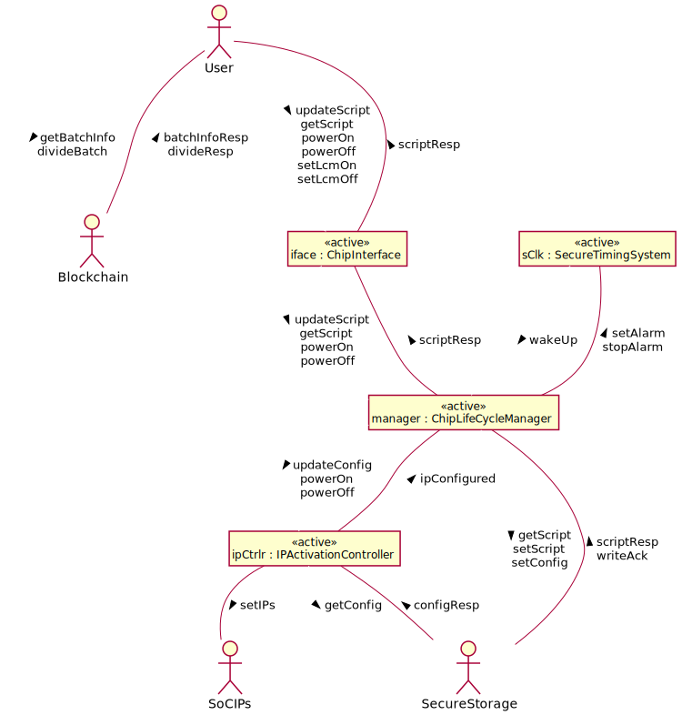

## System Object Behaviors

### `manager` State Machine

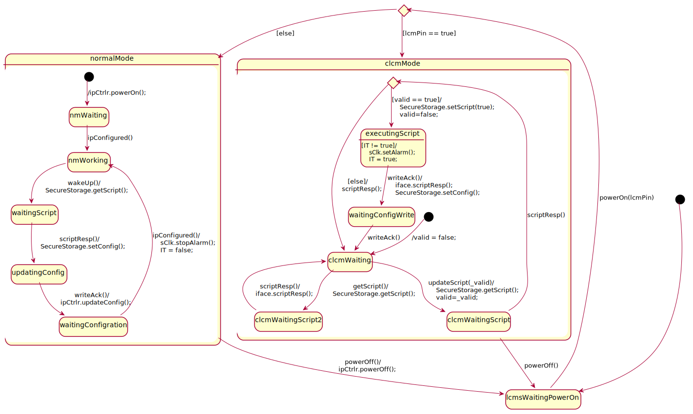

### `iface` State Machine

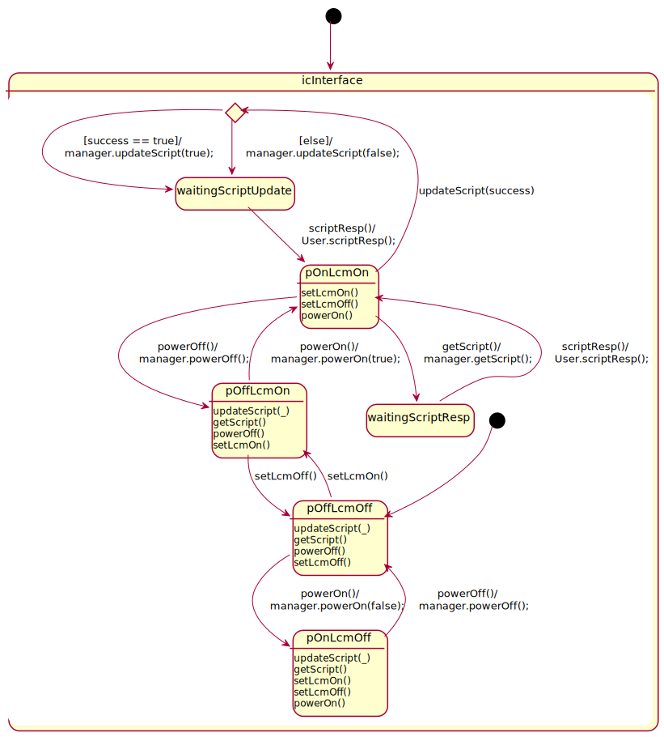

### `ipCtrlr` State Machine


### `sClk` State Machine

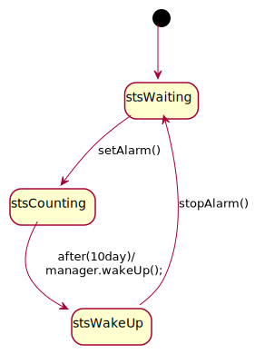

## Environment Behaviors

### `User` State Machine

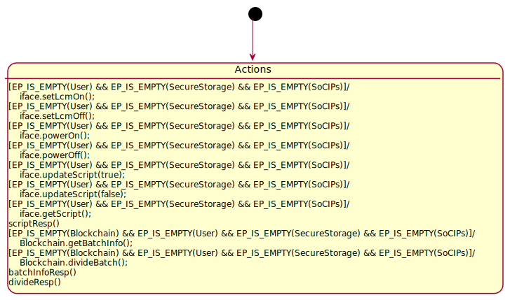

### `Blockchain` State Machine

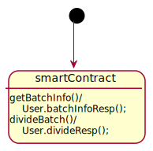

### `SecureStorage` State Machine

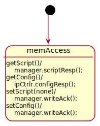

### `SoCIPs` State Machine

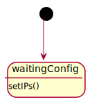
